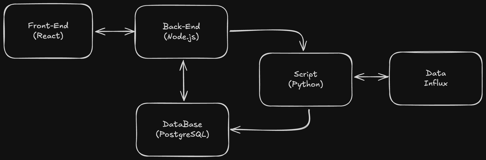

# 🌦️ Weather Dashboard

Aplicación para visualizar información climática reciente y por fecha, usando un stack completo con React, Node.js y Python.

## 📁 Estructura del Proyecto

- `FrontEnd/`: Interfaz hecha con React, Tailwind y Chart.js
- `API/`: API REST creada con Express para consultar y actualizar datos
- `Cleaning/`: Script en Python para limpiar datos, consumir APIs y cargar información a la base de datos

## 🚀 Características

- Visualización de temperaturas máximas, mínimas y actuales
- Gráficas de humedad
- Estadísticas por ciudad (Guatemala City, Retalhuleu)
- Actualización de datos vía script Python
- Consulta por fecha específica

## 🔧 Instalación

### API
- cd API 
- yarn install
- yarn start

### FrontEnd
- cd FrontEnd
- npm install
- npm run dev

### Python
- cd Cleaning
- python3 -m venv .venv
- source .venv/bin/activate
- pip install -r requirements.txt

## 🧭 Diagrama de Arquitectura

## 🎯 Objetivos de Arquitectura

Esta arquitectura fue diseñada para permitir que el script de Python se ejecute de forma automática o manualmente desde la aplicación web, consumiendo una ruta específica en la API. 

De esta manera, la solución es más manejable, escalable y, en caso de que falle el script, no afecta directamente a la aplicación principal.

